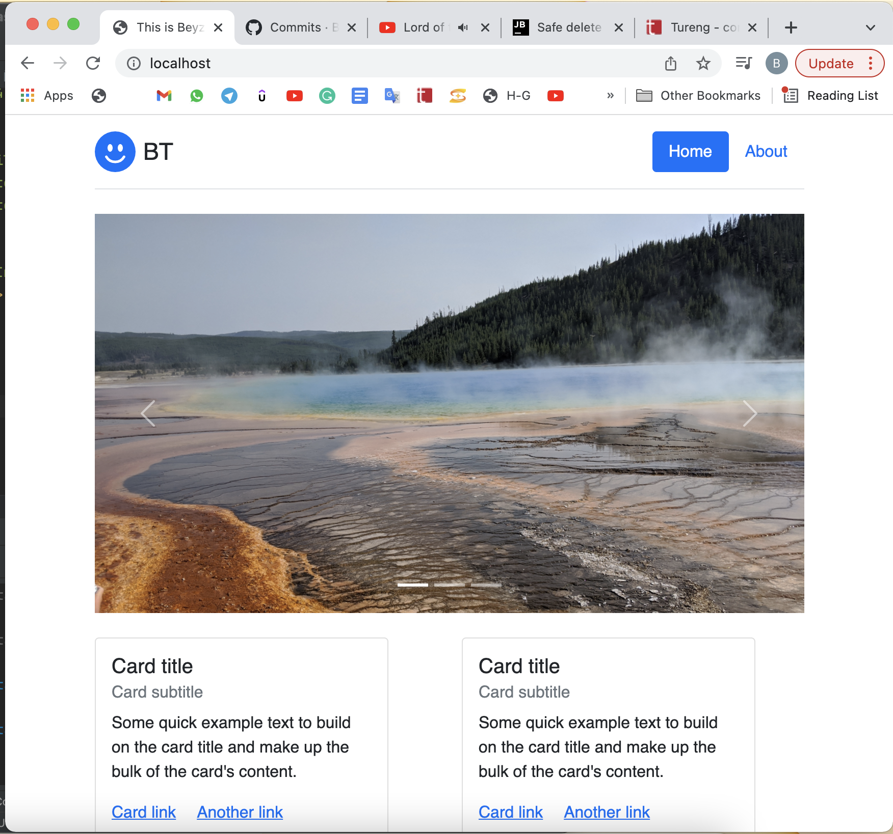
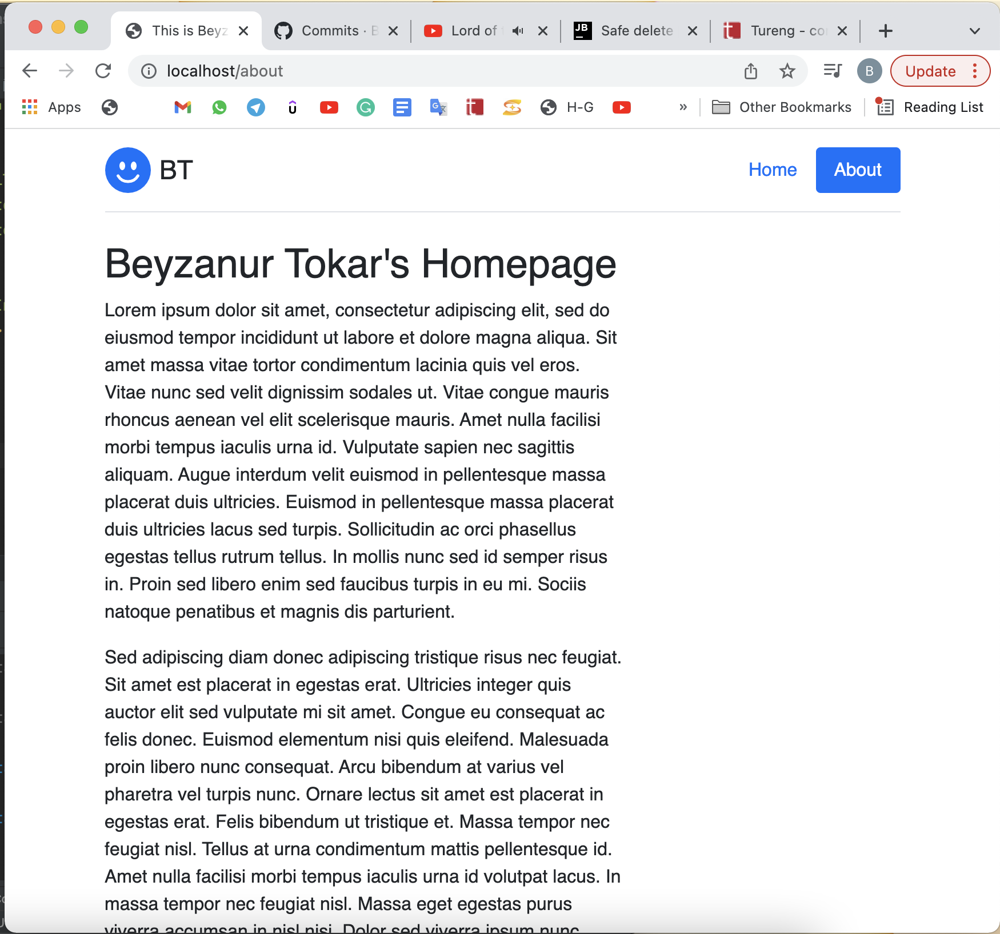
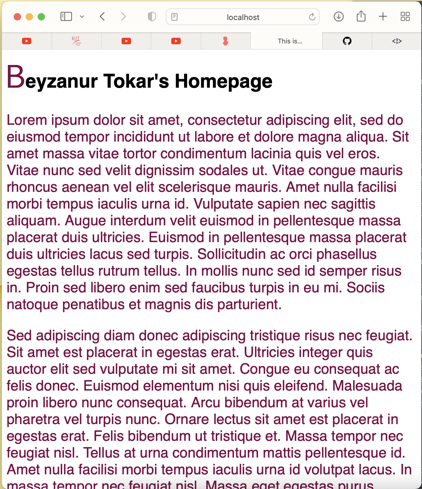

# Docker Nginx Flask Project Setup

Just Run:

docker compose up --build to get it to run and go to localhost to see the site.

## Screenshot of Running Program

FEB 22 2022 - ASSIGNMENT

FEB 15 2022 - ASSIGNMENT
